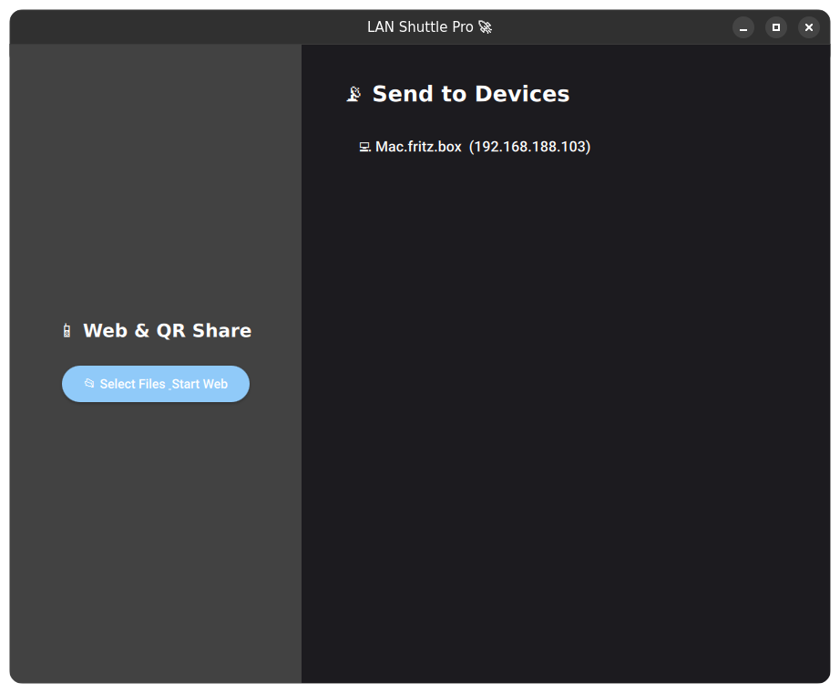

#  LAN Shuttle Pro


**LAN Shuttle Pro** is a blazing-fast, cross-platform local network file sharing tool. Built with a highly optimized **C++ backend** and a hardware-accelerated **Qt Quick/QML frontend**, it allows you to securely send files across your home or office network without needing an internet connection.

Inspired by apps like *LocalSend* and *AirDrop*, but engineered for maximum speed and minimal CPU overhead.

---

## Current Features

- **Blazing Fast Transfers:** Uses raw asynchronous TCP sockets for maximum bandwidth utilization.
- **Zero-Config Discovery:** Automatically finds other devices on your Wi-Fi using UDP broadcast.
- **Web & QR Code Share:** Built-in lightweight HTTP server! Generate a QR code to share files instantly with iPhones, Androids, or Smart TVs—*no app installation required on the receiving device*.
- **Modern, Fluid UI:** Hardware-accelerated Material Design interface running at a smooth 60fps.
- **Native OS Integration:** Uses your native OS file dialogs to pick files and securely ask where you want to save incoming transfers.
- **Cross-Platform:** Write once, run anywhere (Linux, macOS, Windows).

---



---

## Roadmap & Future Features

### Coming Soon: True End-to-End Encryption (TLS 1.3)
*(Expected Release: 08.2026)*

Right now, LAN Shuttle Pro relies on the inherent security of your private home Wi-Fi (WPA2/WPA3). However, we are actively developing **True E2E Encryption** for safe use on public networks (cafes, airports). 

**Upcoming Security Upgrades:**
- **On-the-fly Certificate Generation:** The app will automatically generate ephemeral RSA private keys and self-signed certificates upon launch.
- **TLS 1.3 Socket Wrapping:** All transfers will be upgraded from `QTcpSocket` to `QSslSocket`.
- **PIN-based Pairing:** 6-digit PIN verification to prevent Man-in-the-Middle (MITM) attacks.
- **Certificate Pinning:** The app will remember "Trusted Devices" for seamless future connections.

---

## Tech Stack
- **Core Logic & Networking:** Modern C++17
- **UI Framework:** Qt 6 (QML & Qt Quick)
- **Build System:** CMake
- **Architecture:** Asynchronous Event-Driven (No blocking threads, zero UI freezing)

---

## Building from Source

### Prerequisites (Debian/Ubuntu)
Make sure you have Qt6, QML modules, and a modern C++ compiler installed:
```bash
sudo apt update
sudo apt install build-essential cmake \
    qt6-base-dev qt6-declarative-dev \
    qml6-module-qtquick-controls qml6-module-qtquick-layouts qml6-module-qtquick-dialogs
```
*(For macOS/Windows, we recommend using the [Qt Online Installer](https://www.qt.io/download-qt-installer))*

### Compilation
Clone the repository and compile using CMake:
```bash
git clone https://github.com/tiwut/LAN-File-Shuttle.git
cd LAN-File-Shuttle
mkdir build && cd build

# Generate build files
cmake ..

# Compile using all CPU cores
make -j$(nproc)

# Run the app!
./appLANShuttlePro
```

---

## Contributing
Contributions, issues, and feature requests are welcome! 
Feel free to check out the [issues page](https://github.com/tiwut/LAN-File-Shuttle/issues) if you want to contribute, especially regarding the upcoming OpenSSL / TLS 1.3 implementation.

## License
This project is licensed under the MIT License - see the [LICENSE](LICENSE) file for details.

---
*Developed with ❤️ by Tiwut.*
